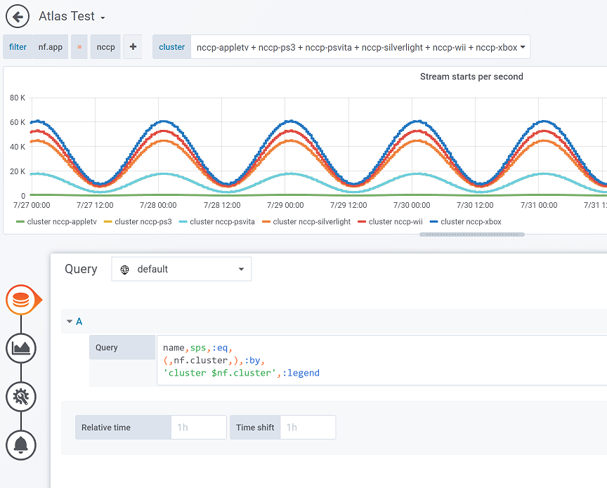
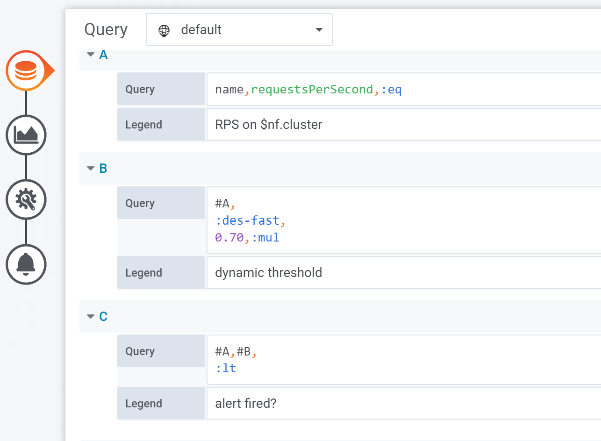

## Purpose

A Grafana 6.2+ datasource plugin for [Netflix Atlas](https://github.com/netflix/atlas/wiki).



## Query references

Queries can refer to and embed other queries by # followed by letter name, as shown here:



## Develop

1. Clone Grafana and create a symlink to this project's root wherever you have cloned Grafana's repository in the `${GRAFANA_REPO}/data/plugins` directory.
2. Run `yarn install` and `yarn run dev` in this repo. The `dev` script will start webpack in development mode, continuously watching files for changes.
3. In the Grafana root directory, run `sudo make run`.

Whenever you make a change to this repository, you will have to manually refresh the browser window, since Grafana's webpack-dev-server does not pick up changes made in `${GRAFANA_REPO}/data/plugins`.

## Running Atlas

1. To explore Atlas commands, you can start Atlas with a set of test metrics with:

```bash
java -jar .atlas/atlas-1.6.0-standalone.jar
```

2. To use Atlas to ship your application's metrics, use [this script](https://github.com/micrometer-metrics/micrometer/blob/master/scripts/atlas.sh) plus [Micrometer Atlas](http://micrometer.io/docs/registry/atlas).